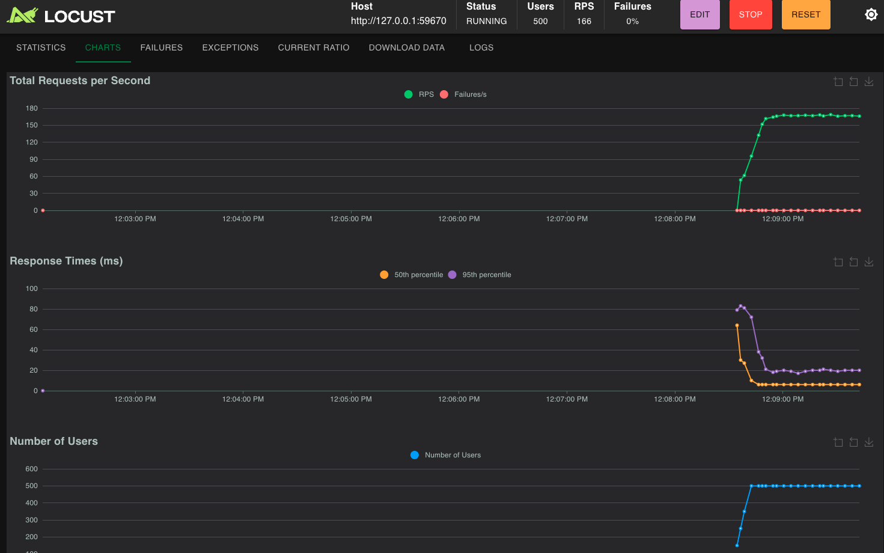
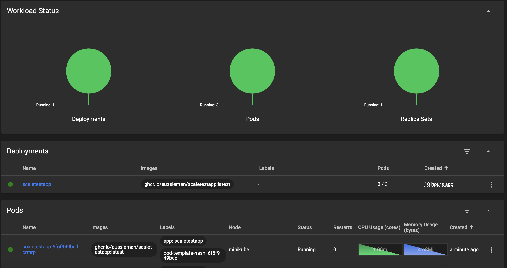
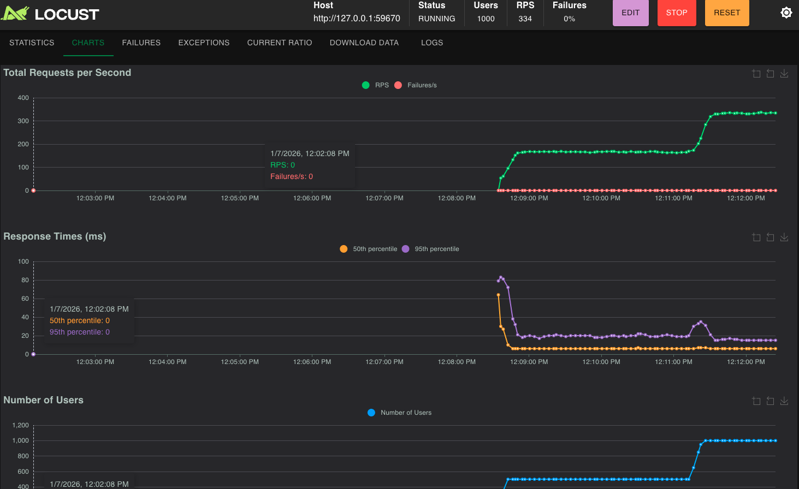
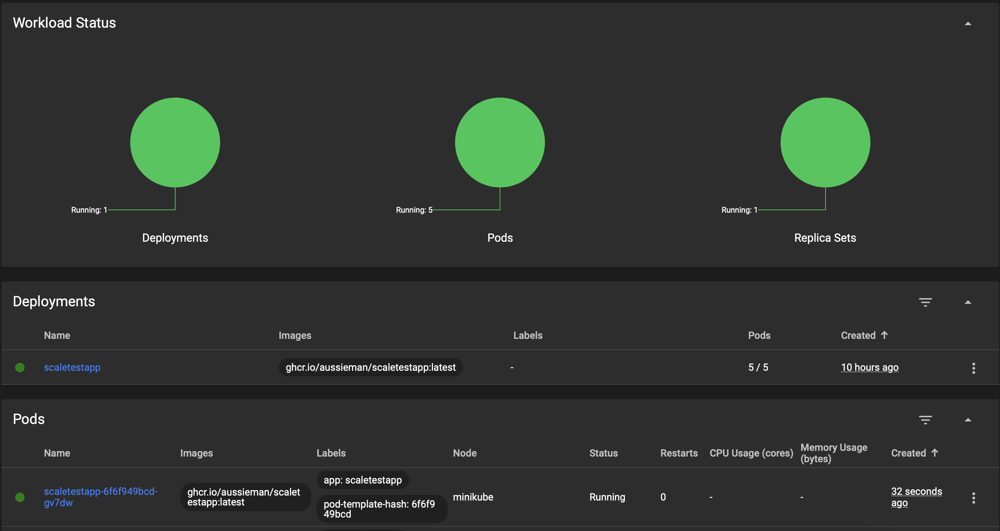
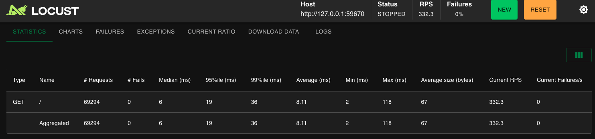
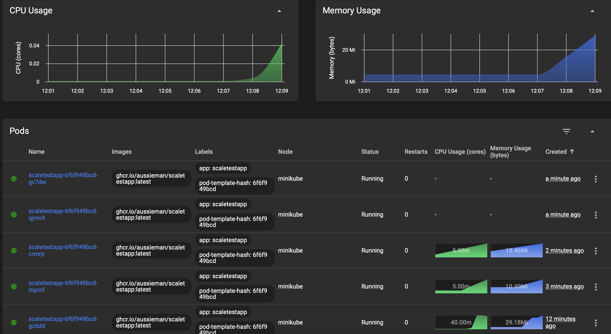

# Инструкция по запуску динамического масштабирования контейнеров

Данная инструкция описывает процесс настройки и тестирования динамического масштабирования в Kubernetes с использованием Minikube.

## Быстрый старт

### Минимальные шаги для запуска Части 1 (масштабирование по памяти):

```bash
# 1. Запуск Minikube и активация metrics-server
minikube start
minikube addons enable metrics-server

# 2. Развертывание приложения
kubectl apply -f deployment.yaml
kubectl apply -f service.yaml
kubectl apply -f hpa.yaml

# 3. Получение URL сервиса
minikube service scaletestapp-service --url

# 4. Запуск Locust (в директории с locustfile.py)
locust

# 5. Открыть http://localhost:8089 и запустить нагрузку
# 6. Мониторинг: minikube dashboard или watch kubectl get hpa
```

# Снимки экрана

## Нагрузка 500 пользователей



## Нагрузка 1000 пользователей




