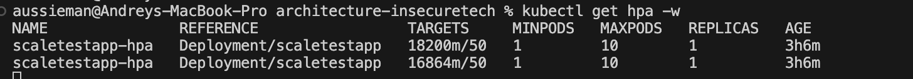
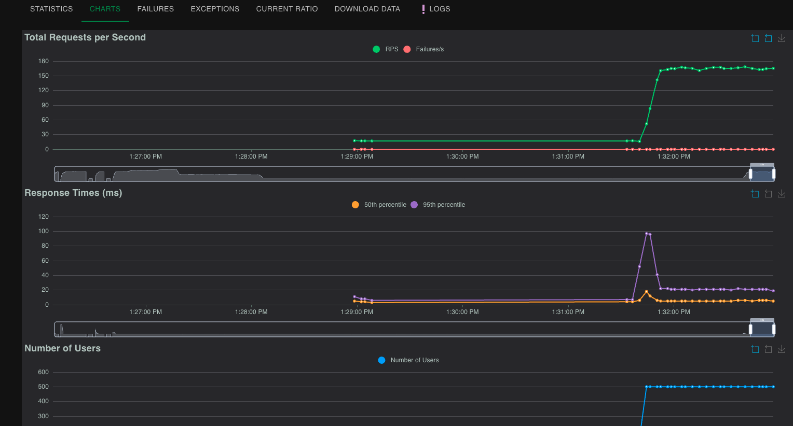
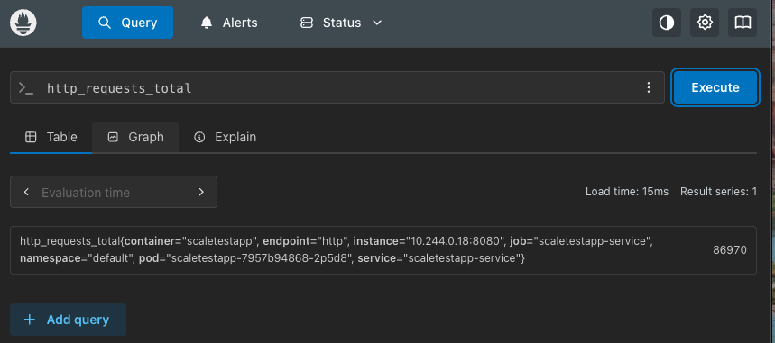
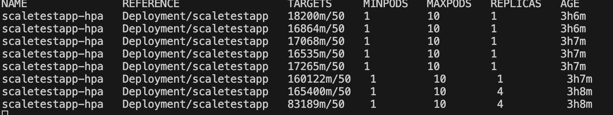
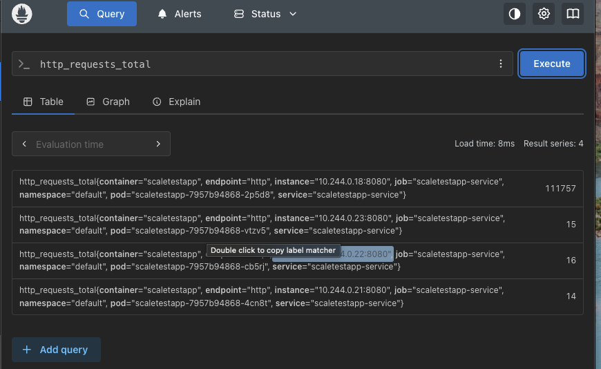

Минимальные шаги для запуска Части 2 (масштабирование по RPS):

# 1. Установка сервисов
./install.sh

Скрипт автоматически:
- Сбрасывает и запускает Minikube
- Устанавливает стек мониторинга (Prometheus + Grafana) через Helm
- Устанавливает Prometheus Adapter для custom metrics
- Развертывает приложение scaletestapp
- Применяет HPA для автоматического масштабирования по RPS

# 2. Запуск мониторинга
./start.sh

Скрипт автоматически:
- Проверяет и освобождает порты
- Выполняет port-forwarding для Prometheus и Grafana
- Выводит пароль администратора Grafana

# 3. Запуск сервиса scaletestapp
minikube service scaletestapp-service --url

Команда запускает туннель для балансировки нагрузки между подами и выводит URL для доступа (например, http://127.0.0.1:xxxxx).
Используйте этот URL для нагрузочного тестирования (Locust), чтобы обеспечить равномерное распределение запросов.

# Доступ к сервисам
- scaletestapp: URL из команды minikube service (для тестирования)
- Prometheus: http://localhost:9090
- Grafana: http://localhost:3333

# Grafana
Пароль администратора выводится в консоли при запуске start.sh.

# HPA (Horizontal Pod Autoscaler)
Настроено автоматическое масштабирование deployment scaletestapp по метрике http_requests_per_second (RPS).
- Min replicas: 1
- Max replicas: 10
- Target: 50 RPS per pod (average)

# Проверка метрик в Prometheus
Откройте http://localhost:9090/targets для проверки целей мониторинга.

# Снимки экрана

## Нагрузка 100 пользователей

## Нагрузка 500 пользователей

